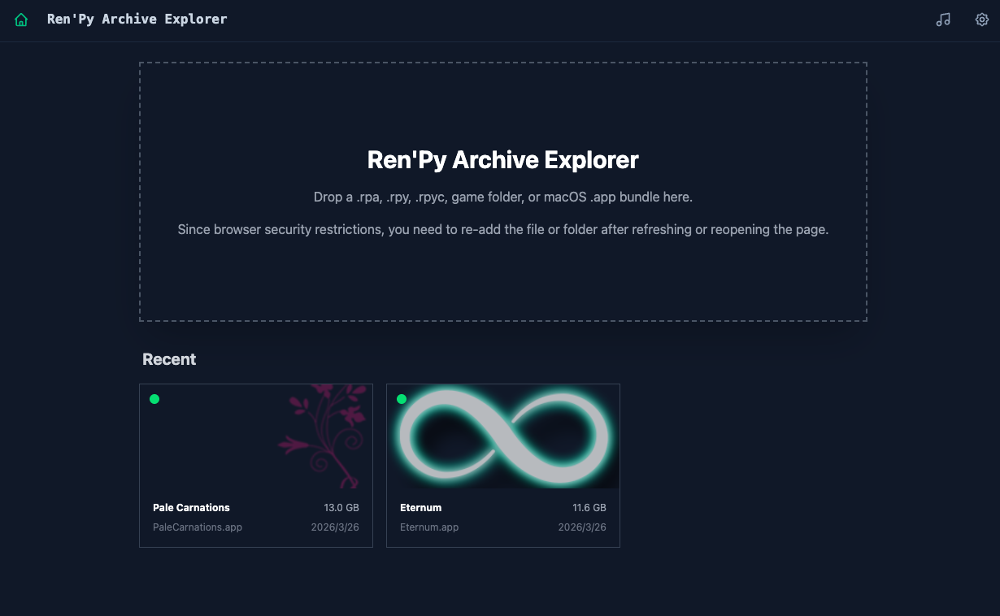
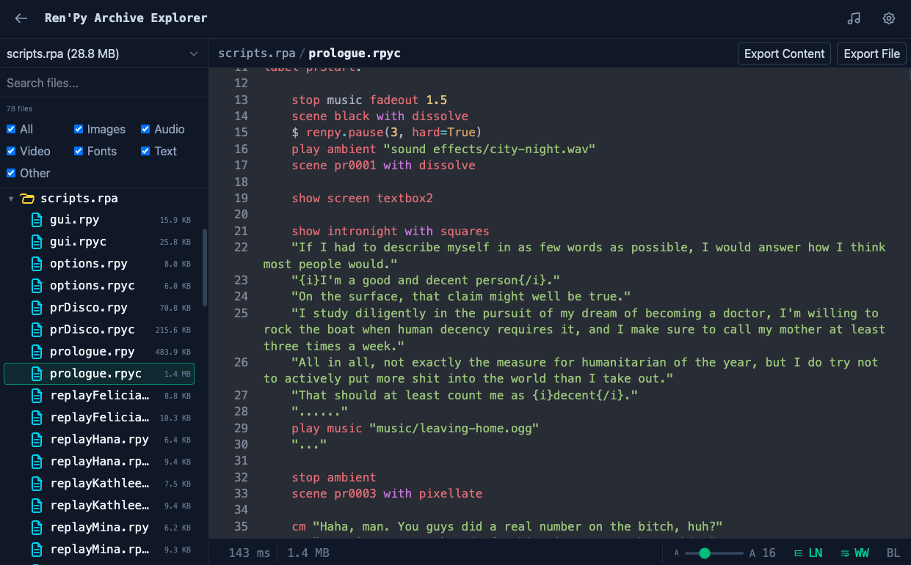
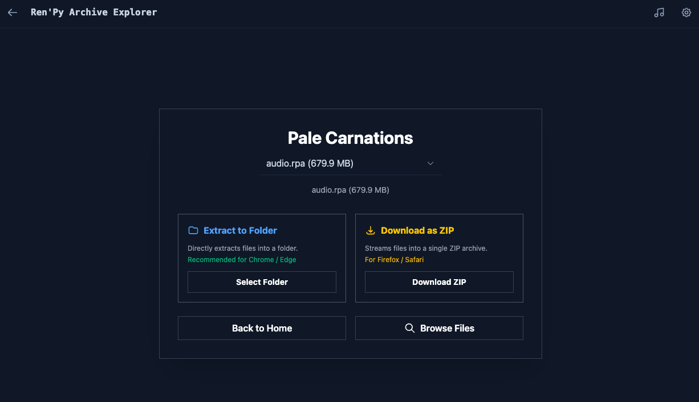

# Ren'Py Archive Explorer

Ren'Py Archive Explorer is a browser-based tool for unpacking `.rpa` archives and decompiling `.rpyc` files.

It lets you browse and preview files inside Ren'Py archives directly in the browser, including images, videos, music, fonts, and script files. You can also export individual files or the entire archive.

Visit:https://asakura-minami.github.io/RPA-Explorer/

## Features

- Unpack `.rpa` archives in the browser
- Decompile `.rpyc` files without Python
- Preview images, videos, music, fonts, and text files
- Export individual files or full archives
- Drag and drop a game directory, `.rpa` file, or single `.rpyc` file
- Fully client-side, with no file uploads
  
## Preview

